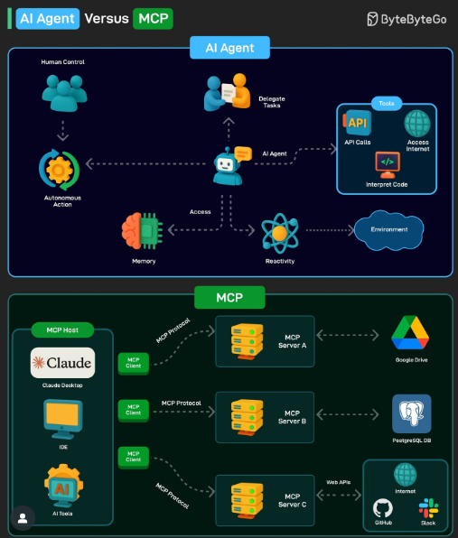

# 🧠 BONUS – AI Agents 1


## 🚀 Agents, Function Calling & Tool Integration

This module was all about turning LLMs into intelligent *agents* — systems that can reason, plan, and interact with tools.

I built an **LLM-powered chatbot** that:

- Takes user questions
- Searches or generates answers
- Writes new entries back into a database using **tool calls** 💾

---

## 💡 Key Learnings

### 🧠 Agents
- LLMs become more than responders — they can plan and decide which tools to invoke.

### 🔧 Function Calling
- Structured JSON schema enables the LLM to understand external functions.
- Used **Groq** to power fast LLM function invocation.

### 🔗 Tool Use
- Tools were defined as Python functions with metadata.
- LLM decides which tool to use, what arguments to pass, and integrates the result.

### 🔁 MCP (Model Context Protocol)
- Used `FastMCP` to simulate a lightweight server that LLMs can call over stdio using JSON-RPC.
- Built a custom `MCPClient` and `MCPTools` wrapper to plug external tools into the chat interface.

---

## 🛠 Agent Workflow

```mermaid
flowchart TD
    User -->|question| Chatbot
    Chatbot -->|tool call| Tool[get_weather / add_entry]
    Tool -->|result| Chatbot
    Chatbot -->|final response| User


# 🧠 BONUS – AI Agents 2

# AI Agents vs Model Context Protocol (MCP)



## Overview
In the context of AI, **agents** and the **Model Context Protocol (MCP)** are distinct yet complementary technologies.  
- **AI Agents** are like the "brains" of an AI system — capable of planning, reasoning, and taking autonomous actions.  
- **MCP** is a standard protocol that allows AI models to easily access and interact with external data and services without needing custom code for each integration.

---

## AI Agents

**Focus:**  
Autonomous decision-making, planning, and task execution.

**Capabilities:**  
- Handle complex tasks  
- Break them into smaller steps  
- Execute those steps using tools and other systems

**Examples:**  
- Travel planning agents  
- Customer service chatbots  
- Code generation assistants

**Key Features:**  
- Reasoning and planning  
- Interaction with external systems to achieve goals  

---

## Model Context Protocol (MCP)

**Focus:**  
Standardized communication and data access between AI models and external systems.

**Capabilities:**  
- Enable AI models to access and integrate with data sources, APIs, and tools

**Examples:**  
- An MCP server providing access to an internal database  
- A weather API  
- A calendar application

**Key Features:**  
- Standardized interface  
- Easy integration  
- Improved maintainability  

---

## How They Work Together

AI agents often **leverage MCP** to access the data and functionality they need to perform their tasks.

For example:  
- An **agent** might use an **MCP server** to query a database for information  
- Or book a flight through an airline's API  

Think of it this way:  
- **Agents** = the *brain* (decision-making)  
- **MCP** = the *hands* (communication channel and tool access)  

They are **not competing** technologies — they work together to enable more powerful and versatile AI systems.

---
