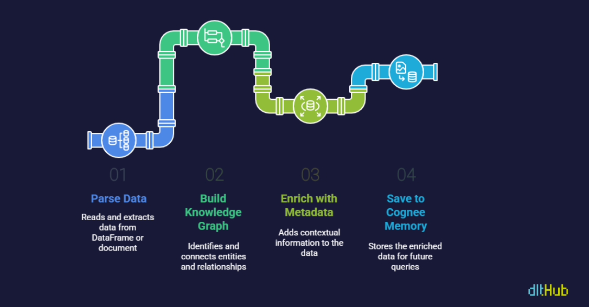

# 🧠 From REST to Reasoning: Ingest, Index & Query with dlt + Cognee

This workshop bridged data pipelines and semantic reasoning — from ingesting data to building LLM-ready knowledge graphs!

## 💡 Key Takeaways

- **What is dlt?**  
  An open-source Python library to build modern ELT pipelines with minimal setup.

- **What is Cognee?**  
  A tool that transforms your data into a queryable memory and knowledge graph — ideal for reasoning.

- **Cognee Node Sets**  
  Tag-based collections that allow organizing, filtering, and enriching graph data.

- **Ontology**  
  A structured, machine-readable definition of entities, classes, properties, and relationships — the foundation for graph reasoning.

## 🔁 Workflow Overview

1. **Ingest** – Load structured/unstructured data via dlt.  
2. **Vectorize & Store** – Embed and persist content using Cognee.  
3. **Graphify** – Build a knowledge graph using Kuzu as the backing graph database.  
4. **Query** – Ask natural-language questions — Cognee fetches relevant subgraphs.  
5. **Reason** – Use retrieved context to construct RAG-style prompts → get grounded LLM answers (e.g., via Gemini).

## 🧪 The Big Idea

Combining automated pipelines (via dlt) with declarative reasoning (via Cognee) brings us closer to production-grade LLM apps — modular, scalable, and intelligent.
